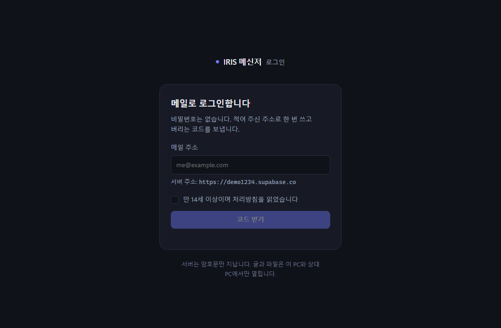
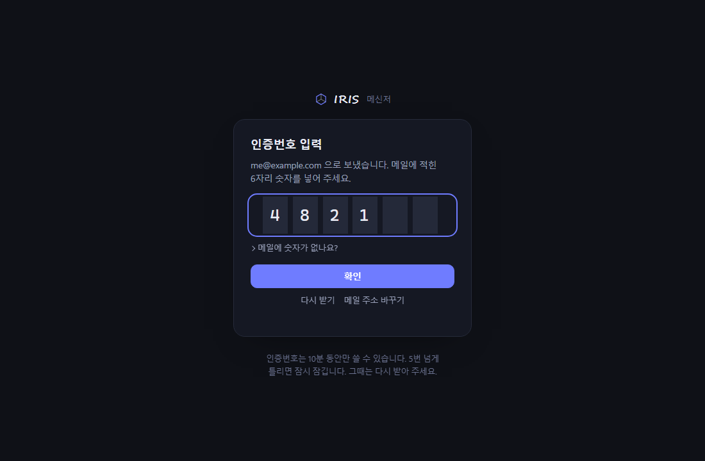
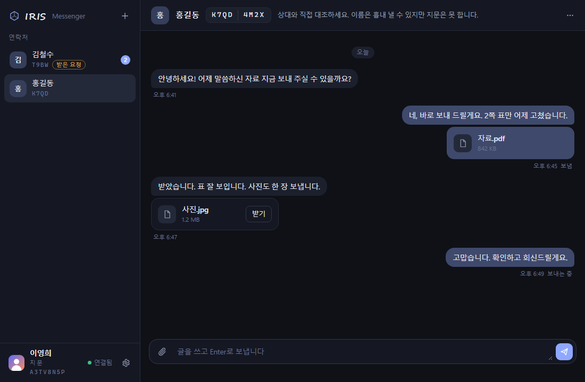
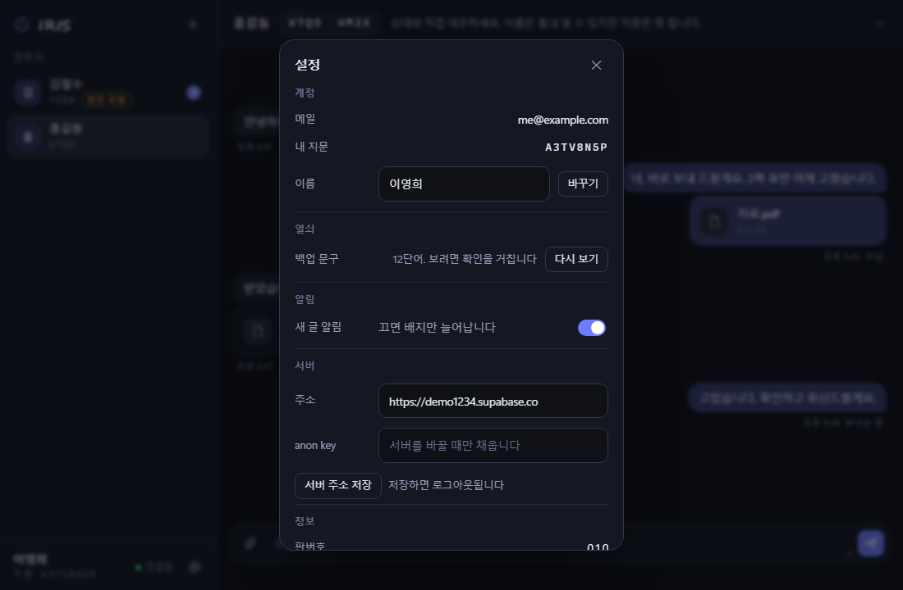

<!-- IRIS Messenger · © 2026 Sejun Ham (함세준) · MIT · https://feynman520.github.io/card/#home -->

# IRIS Messenger

IRIS-Face(https://github.com/Feynman520/d06-p02-iris-face)에 꽂는 종단간 암호화(E2EE, End-to-End Encryption — 보낸 사람과 받은 사람만 풀 수 있고 중간의 서버는 못 읽는 암호화) 사람 간 메신저 확장 모듈입니다. Face 본체는 이 모듈을 몰라도 그대로 동작하며, 모듈을 안 꽂으면 메신저 관련 네트워크 호출이 전혀 일어나지 않습니다(무접촉 원칙).

## 무엇인가

Face 사용자 두 명이 초대 코드를 주고받아 서로를 친구로 등록한 뒤, 글과 파일을 암호화해서 주고받는 1:1 메신저입니다. 서버(허브)는 메시지를 중계·보관하지만 내용은 암호문으로만 보므로, 서버 운영자도 대화 내용을 읽을 수 없습니다. 1차 범위는 사람 대 사람 소통이며, 에이전트 간 소통(사람이 승인한 요청만 전달)은 2차로 예약되어 있습니다.

## 화면

| 시작(메일 주소) | 인증번호 |
|---|---|
|  |  |

| 대화 | 설정 |
|---|---|
|  |  |

설정은 팝업이 아니라 대화 영역을 덮는 한 장입니다. 맨 위 프로필 카드에서 **사진(선택)**·이름을 바꿉니다. 사진은 PC 안에서 96×96 JPEG로 줄여 서버 `profiles`에 두며(처리방침 "서버가 아는 것"에 명시), 친구를 맺은 상대에게만 보입니다. 처리방침 전문은 로그인 화면의 "처리방침 읽기" 링크(모듈이 내주는 한 장, 정본은 `hub/server/처리방침.md`)로 봅니다.

밝은 테마도 있습니다(Face의 테마를 따릅니다): [대화 화면 · 라이트](docs/화면-대화-라이트-2026-09-13.png). 대화 화면의 이름·내용은 화면을 보여 주기 위해 지어낸 것입니다(실제 사용자·대화가 아닙니다).

## 설치 3길

1. **Face 설정에서 설치** — Face의 설정 → 모듈 설치 화면에서 이 저장소의 릴리스 zip(`iris-messenger-vX.Y.Z.zip`)을 선택합니다. 서명·지문·계약 버전·요구 등급을 자동으로 검사한 뒤 `modules\messenger\`에 풀립니다.
2. **손으로 풀기** — GitHub Releases에서 zip을 받아 Face의 `modules\messenger\` 폴더에 직접 풀어 넣습니다. 서명 검사는 건너뛰므로 신뢰할 수 있는 출처의 zip만 이렇게 설치합니다.
3. **개발자 정션(junction)** — 이 저장소를 클론한 뒤 `module\` 폴더를 Face의 `modules\messenger\`로 정션(윈도의 폴더 바로가기 연결)해 코드를 직접 수정하며 씁니다. 개발용입니다.

## 첫 사용

1. 이메일 주소를 입력하면 **인증번호 6자리**가 메일로 옵니다. 비밀번호는 없습니다 — 이 PC에서는 한 번만 하면 되고, 그 뒤로는 로그인 정보를 윈도 DPAPI로 잠가 두어 다시 묻지 않습니다. 메일에 숫자 없이 링크만 오면(허브의 메일 설정에 따라 다름) 링크를 누르지 말고 링크 주소를 복사해 "메일에 숫자가 없나요?" 아래 칸에 붙여 넣습니다. 어느 쪽이든 브라우저에서 링크를 클릭하는 방식은 쓰지 않습니다.
2. 인증번호를 넣어 로그인하고, 상대에게 보일 이름을 정합니다.
3. **12단어 복구 문구가 한 번 화면에 뜹니다 — 반드시 종이 등 오프라인에 적어 두세요.** 복사 버튼은 일부러 없습니다(클립보드에 남는 것을 막기 위해). 이 12단어를 잃으면 기기를 바꿨을 때 지난 대화를 복원할 수 없습니다.
4. 대화하고 싶은 상대와 **초대 코드**를 서버 밖의 경로(카카오톡, 문자, 대면 등)로 주고받습니다.
5. 코드를 입력하면 상대의 이름과 **고유번호(공개 열쇠를 8자리로 줄인 값)**가 뜹니다. **반드시 상대와 고유번호를 직접 비교(전화·대면 등으로 불러주기)한 뒤에 수락하세요** — 이 대조를 건너뛰면 서버가 열쇠를 바꿔치기하는 공격(MITM)을 알아챌 방법이 없습니다.
6. 상대가 수락하면 대화가 시작됩니다.

## 서버가 아는 것 / 모르는 것

| 아는 것 | 모르는 것 |
|---|---|
| 이메일 | 메시지 내용(평문) — 암호문만 저장 |
| 표시 이름 · 프로필 사진(선택, 96×96 JPEG) | 파일 이름·크기 — 암호문 안에 들어 있어 서버는 못 봄 |
| 공개 열쇠(public key) | 개인 열쇠·12단어 복구 문구 — 서버에 절대 전송되지 않음 |
| 친구 관계(누가 누구와 연결돼 있는지) | 사용자의 작업 내용·작업 과정·세션 기록 |
| "누가 누구에게 언제 몇 번" 보냈는지(메타데이터) | 파일 실제 내용 |

자세한 수집·보관·삭제 기준은 [`hub/server/처리방침.md`](hub/server/처리방침.md)에 있습니다.

## 솔직한 한계

이 프로젝트는 스스로를 완벽하다고 주장하지 않습니다. 알려진 한계를 숨기지 않고 적습니다.

- **외부 보안 감사를 받지 않았습니다.** 암호화 방식은 잘 알려진 부품(X25519·HKDF·AES-256-GCM)을 조립한 것이지만, 독립된 제3자의 보안 검토는 아직 없습니다.
- **전방 비밀성(forward secrecy)은 절반만 있습니다.** 메시지마다 일회용 열쇠를 새로 만들지만(더블 래칫 같은 열쇠 연쇄 갱신은 없음), 수신자의 개인 열쇠가 유출되면 그 사람이 받은 지난 메시지를 전부 다시 열어볼 수 있습니다.
- **고유번호는 8글자(약 40비트)입니다.** 짧아서 눈으로 비교하기 쉽지만, 그만큼 완전한 충돌 회피를 보장하는 길이는 아닙니다 — 실제 방어력은 "고유번호를 실제로 대조하는 습관"에 달려 있습니다.
- **DPAPI(윈도 자체 암호화)는 같은 윈도 계정 안의 악성코드까지 막지는 못합니다.** 다른 사용자 계정·다른 PC·복사된 백업 파일에서 열쇠를 못 꺼내는 것까지가 DPAPI가 보장하는 범위입니다.
- **모듈은 별도 프로세스로 격리되지만, 이는 버그 격리이지 악의적 코드로부터의 격리가 아닙니다.** 같은 운영체제 사용자 권한을 공유하므로, 악의적인 모듈이 서명 검사를 통과했다면 이 격리만으로는 막을 수 없습니다(방어선은 서명 검증입니다).
- **복호화된 메시지는 내 PC에 평문으로 저장됩니다.** `state\messages\*.ndjson`에 암호화 없이 남으므로, PC 자체의 디스크 암호화(BitLocker 등)나 물리적 보안은 별도로 챙겨야 합니다.

## 자기 허브 세우기

공식 허브에 의존하지 않고 자기 자신의 Supabase 프로젝트로 서버를 세울 수 있습니다. 절차는 [`hub/server/README.md`](hub/server/README.md)에 있습니다.

## 재현 빌드

릴리스 zip이 실제로 이 저장소의 소스에서 나왔는지 스스로 확인할 수 있습니다. `npm run build:zip`으로 같은 소스 커밋에서 zip을 다시 만들면, 그 안의 `manifest.json`에 파일별 SHA-256 해시와 소스 커밋 해시가 함께 적혀 있어 릴리스에 실린 값과 대조할 수 있습니다.

## 라이선스

MIT © 2026 Sejun Ham (함세준)

---

# IRIS Messenger (English summary)

An end-to-end encrypted (E2EE) person-to-person messaging module that plugs into [IRIS-Face](https://github.com/Feynman520/d06-p02-iris-face). Face itself has no knowledge of this module, and with the module absent, Face makes zero messenger-related network calls (zero-touch principle).

**What it is.** Two Face users exchange an invite code out-of-band, add each other as contacts, and exchange encrypted text and files. The hub (server) relays and stores messages but only ever sees ciphertext — the operator cannot read message contents.

**Install (3 ways).** ① Face Settings → Install Module → pick the release zip (signature/fingerprint/contract/grade checked automatically). ② Manually unzip the release into Face's `modules\messenger\`. ③ Developer junction: clone this repo and junction `module\` into `modules\messenger\`.

**First use.** Email → a login mail: if it carries a 6-digit code, type the code; if it carries only a link, do **not** click it — copy the link address and paste it in (which of the two you get depends on the hub's mail configuration) → display name → a 12-word recovery phrase is shown once (write it down offline; no copy button, to avoid clipboard leakage) → exchange an invite code out-of-band with a contact → **compare the 8-character key fingerprint out-of-band before accepting** (this is the only defense against a server-side key-swap/MITM attack) → chat once accepted.

**What the server knows / doesn't know:** email, display name, optional profile photo (a 96×96 JPEG, stored unencrypted like the display name), public key, contact relationships, and send/receive metadata (who-to-whom-when) — never message or file contents, filenames, private keys, or the 12-word phrase. Details: [`hub/server/처리방침.md`](hub/server/처리방침.md) (Korean; the privacy notice governing the official hub).

**Honest limits.** No external security audit · forward secrecy is only partial (no double-ratchet — a leaked private key exposes past messages) · the 8-character/~40-bit fingerprint is short by design (real protection depends on actually comparing it) · Windows DPAPI does not protect against malware running as the same Windows user · the module's separate-process isolation is bug isolation, not malicious-code isolation (the defense against a malicious module is the release signature check) · decrypted messages are stored in plaintext on local disk.

**Self-hosting:** see [`hub/server/README.md`](hub/server/README.md).

**Reproducible build:** `npm run build:zip` regenerates the release zip from source; `manifest.json` inside carries per-file SHA-256 hashes plus the source commit hash for comparison against a published release.

**License:** MIT © 2026 Sejun Ham (함세준)
